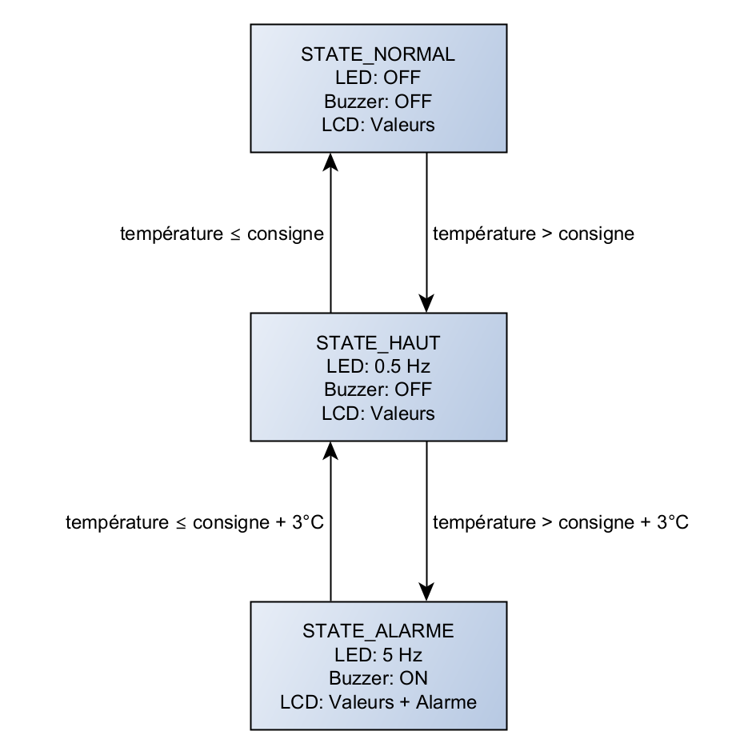
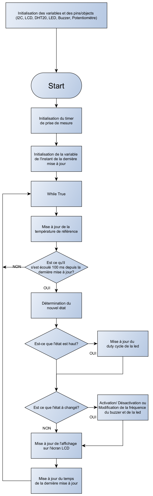

# Exercice – Système de régulation et alarme de température

---

## Objectif

L’objectif de cet exercice est de concevoir un système capable de surveiller la température ambiante et de déclencher une alarme visuelle et sonore lorsque la température dépasse une consigne réglable par l’utilisateur.  
Un potentiomètre permet d’ajuster la température de consigne, tandis qu’un capteur DHT20 mesure la température réelle.  
L’écran LCD affiche la température mesurée et la consigne.  
Une LED et un buzzer signalent les situations anormales.

Le [pdf](./Exercice3.pdf) associé à cet exercice contient plus d’explications sur le matériel utilisé et les consignes à suivre.

---

## Matériel utilisé

- **Capteur DHT20** : mesure la température ambiante.  
- **LCD1602 I2C** : affiche la température mesurée et la consigne.  
- **Potentiomètre** : ajuste la température de consigne entre 15°C et 35°C.  
- **LED (PWM)** : indique visuellement l’état du système.  
- **Buzzer (PWM)** : émet un signal sonore en cas d’alarme.

---

## Logique générale

Le programme mesure en continu la température ambiante et la compare à la température de consigne.  
Trois états sont possibles :  
- **Normal** : la température est inférieure ou égale à la consigne.  
- **Haut** : la température est au-dessus de la consigne mais inférieure au seuil d’alarme.  
- **Alarme** : la température dépasse la consigne de plus de 3°C.

Selon l’état détecté :
- L’écran LCD affiche la consigne et la température, ou un message d’alarme.  
- La LED clignote plus ou moins rapidement selon l’écart à la consigne.  
- Le buzzer s’active uniquement en cas d’alarme.  

Le passage d’un état à l’autre déclenche automatiquement les actions associées.

---

## Fonctionnement

1. **Lecture de la température**  
   Le capteur DHT20 mesure la température ambiante à intervalles réguliers.  

2. **Réglage de la consigne**  
   Le potentiomètre est lu en continu pour ajuster la température de consigne.  
   La valeur analogique est normalisée et arrondie à 0,5°C près.

3. **Détermination de l’état**  
   Le programme compare la température mesurée à la consigne pour déterminer l’état du système (normal, haut ou alarme).  

4. **Affichage sur l’écran LCD**  
   En état normal ou haut, l’écran affiche la consigne et la température ambiante.  
   En état d’alarme, le mot *ALARM* est affiché soit en défilement, soit en clignotement, selon le mode choisi.  

5. **Signalisation visuelle et sonore**  
   - En mode **haut**, la LED clignote lentement avec une intensité variable selon la différence de température.  
   - En mode **alarme**, la LED clignote rapidement à luminosité maximale et le buzzer s’active.

---

## Diagramme d’état

Le diagramme suivant illustre les transitions entre les trois états principaux du système :

---

## Organigramme de la boucle principale

Le schéma ci-dessous montre la logique de la boucle principale du programme :

