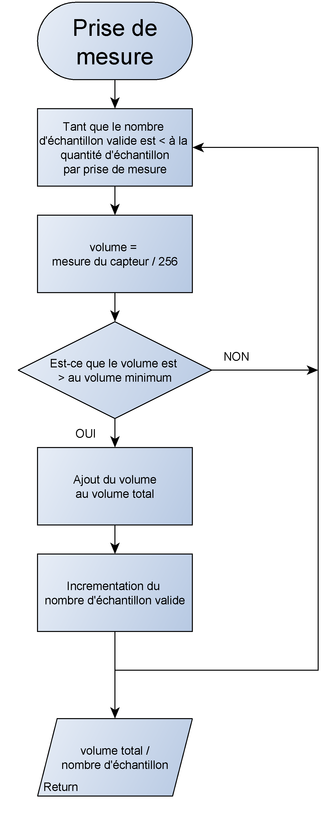

# Exercice – Contrôle d’une LED RGB au rythme de la musique

---

## Objectif

L’objectif de cet exercice est de développer un système capable de faire varier la couleur d’une LED RGB en fonction du rythme de la musique ambiante.  
Un capteur sonore mesure en continu le niveau de bruit, et chaque battement détecté entraîne un changement de couleur de la LED.  
Le programme estime également le rythme de la musique en **BPM (Battements Par Minute)** à partir des intervalles entre battements détectés.

Le [pdf](./Exercice4.pdf) associé à cet exercice détaille le matériel utilisé et les consignes de mise en œuvre.

---

## Matériel utilisé

- **Raspberry Pi Pico W** : carte microcontrôleur exécutant le script MicroPython.  
- **Module microphone (capteur sonore)** : mesure le niveau sonore ambiant.  
- **LED RGB (WS2812)** : change de couleur à chaque battement détecté.  
- **Fils de connexion** : assurent les liaisons entre les composants.  

---

## Logique générale

Le programme lit en continu le niveau sonore à l’aide du capteur analogique et détecte les pics sonores caractéristiques des battements musicaux.  
Chaque fois qu’un battement est identifié :
- La **LED RGB** change instantanément de couleur aléatoire.  
- Le temps entre deux battements est enregistré afin de calculer le **BPM** (Battements Par Minute).  

Une moyenne glissante est utilisée pour lisser les mesures et éviter les détections parasites dues au bruit ambiant.

---

## Fonctionnement

1. **Initialisation du système**  
   Le capteur sonore (ADC) et la LED RGB (WS2812) sont initialisés.  
   Les paramètres de seuils, tailles de fenêtres et filtres sont configurés.  

2. **Lecture et filtrage du signal sonore**  
   Le microphone fournit des échantillons analogiques en continu.  
   Seuls les échantillons dépassant un seuil minimal sont pris en compte.  
   Une moyenne glissante du bruit est calculée pour s’adapter au niveau sonore ambiant.  

3. **Détection des battements**  
   Si le niveau sonore mesuré dépasse un seuil proportionnel au bruit moyen, un battement est détecté.  
   Un intervalle minimal entre deux battements est imposé pour éviter les fausses détections.  

4. **Réaction à la détection**  
   Lorsqu’un battement est détecté :
   - La LED RGB change de couleur aléatoirement.  
   - Le temps écoulé depuis le précédent battement est enregistré pour le calcul du BPM.  

5. **Calcul du BPM**  
   Les intervalles entre battements sont moyennés pour obtenir un BPM stable et représentatif du rythme musical.

---

## Limites du système

Le capteur sonore utilisé n’est **pas assez précis** pour analyser les fréquences complexes d’une musique.  
Le programme se base uniquement sur les **variations d’amplitude (volume)** pour détecter les battements.  
Ainsi :
- Avec une **musique réelle**, le rythme n’est pas détecté correctement car les variations de volume sont trop irrégulières.  
- Le système fonctionne uniquement avec un **signal régulier et marqué**, comme un **métronome** ou des **claquements de mains**.  

---

## Organigrammes

### 1. Organigramme de la boucle principale
Cet organigramme illustre le fonctionnement général du programme, depuis la lecture du capteur jusqu’à la mise à jour du BPM et de la LED.  

  

### 2. Organigramme de la détection de battement
Cet organigramme détaille la logique utilisée pour identifier un battement en comparant le niveau sonore actuel au bruit moyen.  

  

### 3. Organigramme de la prise de mesure
Cet organigramme montre comment les échantillons du capteur sonore sont acquis, filtrés et moyennés pour fournir une mesure fiable.  

  

---

## Démonstration

Une vidéo de démonstration est disponible dans les fichiers du repository.
