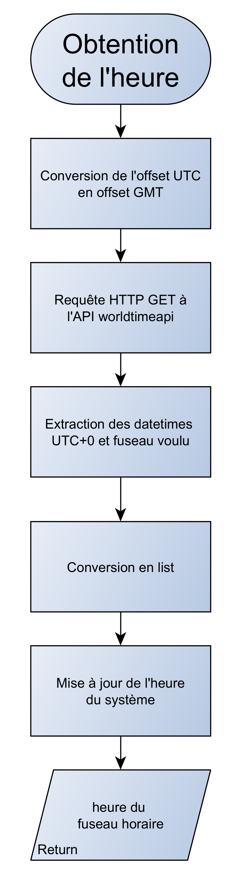
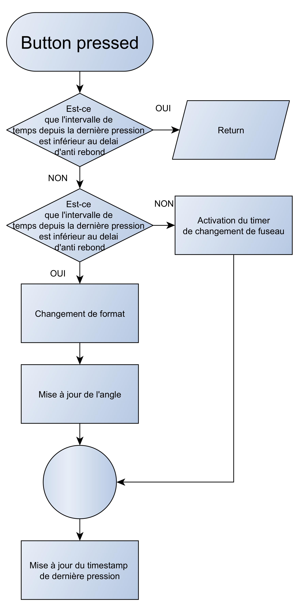

# Exercice – Horloge avec Raspberry Pi Pico W et Servo Moteur

---

## Objectif

L’objectif de cet exercice est de **construire une horloge connectée** utilisant un **Raspberry Pi Pico W** et un **servo moteur**.  
L’heure est récupérée automatiquement via **internet** à l’aide de l’API [worldtimeapi.org](https://worldtimeapi.org), puis convertie en **angle de rotation** du servo moteur.  
L’aiguille représentée par le servo indique la progression de la journée, selon le format **12h ou 24h**, et prend en compte les **fuseaux horaires** configurables via un **bouton poussoir**.

Le [pdf](./Exercice5.pdf) associé à cet exercice détaille le matériel, les objectifs et les consignes de mise en œuvre.

---

## Matériel utilisé

- **Raspberry Pi Pico W** : microcontrôleur exécutant le code MicroPython.  
- **Servo moteur** : représente la position de l’aiguille d’horloge selon l’heure récupérée.  
- **Bouton poussoir** : permet de changer le **fuseau horaire** ou de basculer entre le **format 12h / 24h**.  
- **Connexion Wi-Fi** : utilisée pour interroger l’API de temps.  
- **Fils de connexion** : assurent les liaisons entre le Pico, le servo et le bouton.  

---

## Logique générale

Le programme effectue en continu les actions suivantes :

1. **Connexion Wi-Fi** au réseau local à l’aide du module `network`.  
2. **Requête HTTP** à l’API *worldtimeapi.org* pour obtenir l’heure courante en format JSON.  
3. **Extraction** et **conversion** de l’heure en minutes depuis minuit.  
4. **Transformation** des minutes en **angle (0° à 180°)** selon le format horaire choisi :  
   - En **format 12h**, 12 heures couvrent 180° (inversion de sens).  
   - En **format 24h**, 24 heures couvrent 180° (progression linéaire).  
5. **Commande du servo moteur** via signal PWM selon l’angle calculé.  
6. **Interaction avec le bouton poussoir** :  
   - *Pression simple* → changement du **fuseau horaire (UTC-12 à UTC+12)**.  
   - *Double clic rapide* → bascule du **format horaire (12h ↔ 24h)**.  
7. **Journalisation des erreurs** en console ou dans un fichier `error_log.txt` si activée.

---

## Fonctionnement détaillé

### 1. Connexion au Wi-Fi
Le Pico W tente de se connecter au réseau défini
En cas d’échec, il applique une stratégie de reconnexion ou une exception selon le mode configuré.

### 2. Obtention de l’heure depuis l’API
Le programme interroge régulièrement l’API :
```
http://worldtimeapi.org/api/timezone/Etc/GMT+X
```
où `X` correspond au décalage configuré (`utc_offset`).

Les valeurs `datetime` et `utc_datetime` sont extraites du JSON et converties en liste `[année, mois, jour, heure, minute, seconde]`.

### 3. Conversion de l’heure en angle
L’heure obtenue est convertie en minutes depuis minuit
Puis traduite en angle via interpolation linéaire
En mode **12h**, l’angle est inversé pour une représentation miroir

### 4. Commande du servo moteur
L’angle est transmis au servo à l’aide d’un signal **PWM**

### 5. Gestion du bouton poussoir
Chaque pression / flan montant du bouton déclanche une interruption matérielle appelant une fonction permettant qu'un :
- **Double clic rapide** : change le format 12h / 24h.
- **Clic simple** : incrémente le fuseau horaire de -12 à +12.

Chaque changement entraîne la **recalibration de l’angle du servo** selon la nouvelle configuration.

---

## Gestion des erreurs et du journal

Le système peut :
- **Afficher** les erreurs dans la console (`CONSOLE_LOG = True`)  
- **Sauvegarder** les erreurs dans un fichier texte (`FILE_LOG = True`) limité à 10 Ko.  

Les erreurs incluent le **contexte**, le **timestamp** et la **trace complète**.

---

## Organigrammes

### 1. Organigramme de la boucle principale
Présente le déroulement global du programme : connexion au Wi-Fi, mise à jour régulière de l’heure depuis l’API, calcul de l’angle et positionnement du servo, ainsi que la gestion des interactions via le bouton poussoir.  
<p align="center">
  
</p>

### 2. Organigramme de mise à jour de l’heure
Décrit le processus de conversion de l’heure récupérée depuis l’API en minutes, puis en angle pour le servo moteur.  
<p align="center">
  
</p>

### 3. Organigramme d’obtention de l’heure
Explique comment l’API *worldtimeapi.org* est interrogée pour récupérer les informations de temps au format JSON, puis comment ces données sont extraites et converties avant d’être stockées dans le RTC du Pico.  
<p align="center">
  
</p>

### 4. Organigramme de la fonction `button_pressed()`
Montre le fonctionnement de la gestion du bouton poussoir :  
- Détection d’un **double clic rapide** pour basculer entre le format **12h et 24h**.  
- Détection d’un **clic simple** pour changer le **fuseau horaire** (de -12 à +12). (timer relié à la boucle principale)
- Gestion de l’**anti-rebond** et du **timer de clic** pour éviter les appuis multiples parasites.  
Chaque action déclenche une **mise à jour immédiate** de l’angle du servo en fonction du nouveau paramètre en estimant l'heure du nouveau fuseau.  
<p align="center">
  
</p>

---

## Améliorations possibles

- Prise en compte de l'heure d'été/hiver
- Utilisation d'un écran LCD pour une meilleur lecture
- Utilisation d'un deuxième servo moteur pour les minutes

---
